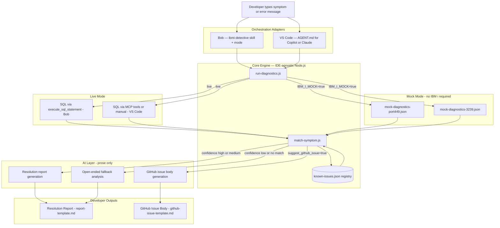
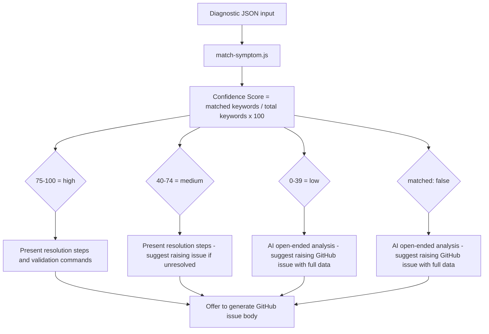
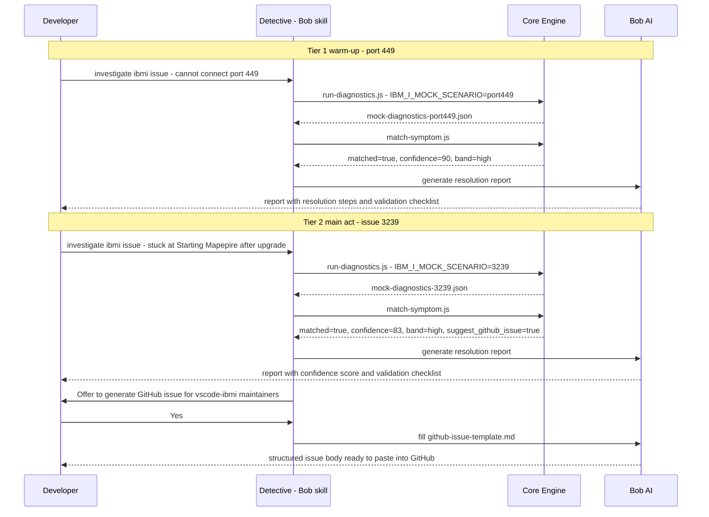
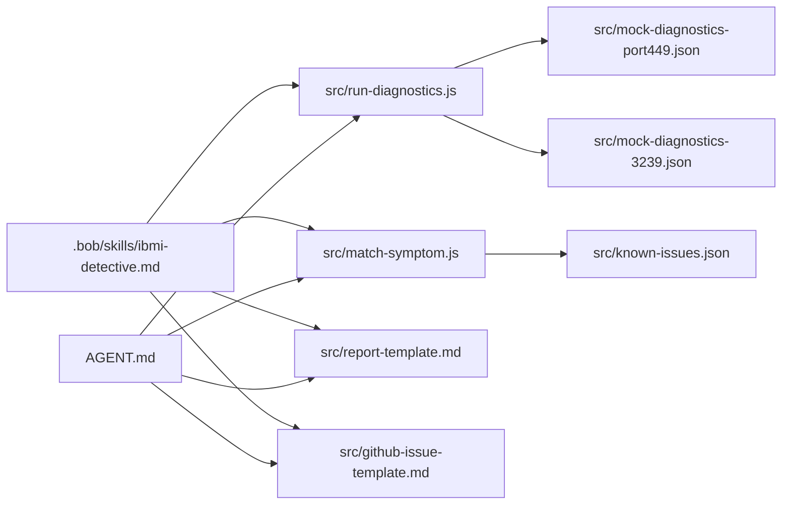

# IBM i Developer Detective — Architecture

## Overview

The Detective is built on a **two-adapter, one-core-engine** design. The core engine
(diagnostic runner, symptom matcher, known issue registry, templates) is plain
JavaScript/JSON — IDE-agnostic, no AI, no external dependencies. Two thin orchestration
adapters sit on top: one for Bob, one for VS Code with Copilot or Claude. Both call the
same scripts and reference the same templates.

---

## Full Pipeline

---

## Confidence Score Flow

---

## Demo Flow — Two Tiers

---

## AI vs Deterministic Split

| Component | Type | File |
|---|---|---|
| Known Issue Registry | Deterministic | `src/known-issues.json` |
| Diagnostic runner - mock mode | Deterministic | `src/run-diagnostics.js` |
| Diagnostic runner - live mode query emit | Deterministic | `src/run-diagnostics.js` |
| Symptom matcher | Deterministic | `src/match-symptom.js` |
| Confidence score calculation | Deterministic | `src/match-symptom.js` |
| Bob orchestration | Orchestration | `.bob/skills/ibmi-detective.md` |
| Bob mode definition | Orchestration | `.bob/custom_modes.yaml` |
| VS Code orchestration | Orchestration | `AGENT.md` |
| Resolution report prose | AI | fills `src/report-template.md` |
| GitHub issue body | AI | fills `src/github-issue-template.md` |
| Open-ended fallback analysis | AI | inline in skill/AGENT.md |

---

## File Dependency Map

